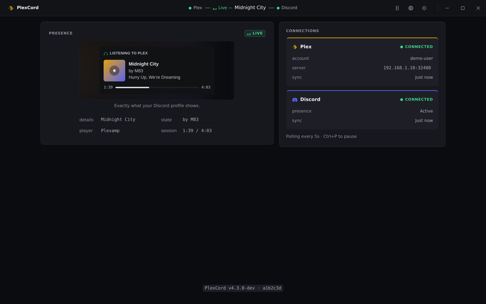
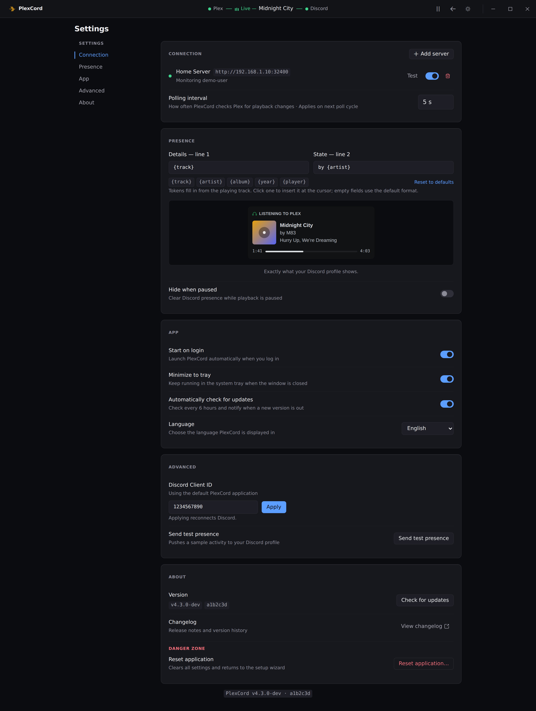
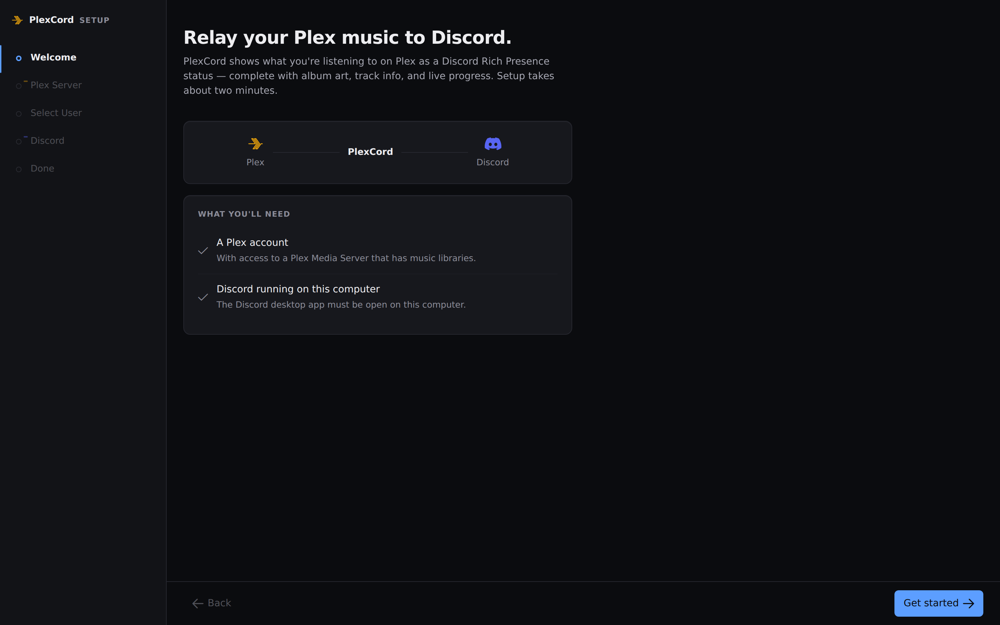
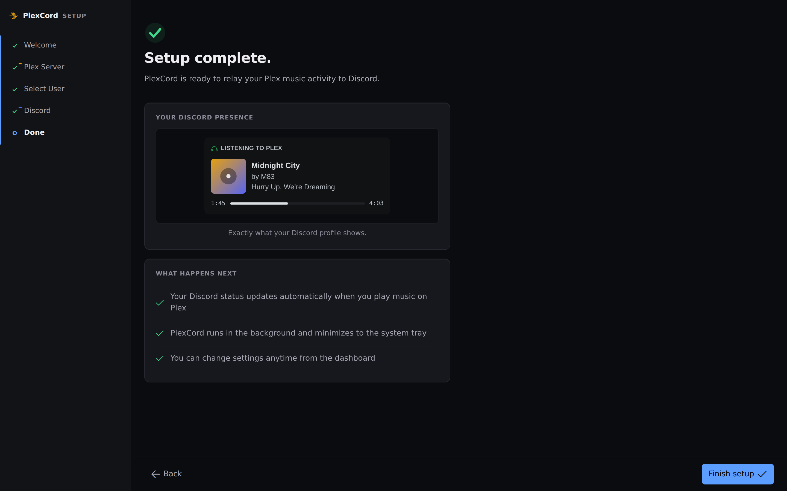

# PlexCord

> Display your Plex music playback as Discord Rich Presence

PlexCord is a lightweight, cross-platform desktop application that bridges your Plex Media Server and Discord, showing what you're listening to in real-time. Built with Go + Vue 3 + Wails.



## Features

- 🎵 Real-time Plex music playback detection
- 💬 Discord Rich Presence integration (track, artist, album, artwork)
- 🖥️ Cross-platform support (Windows, macOS, Linux)
- 🔐 Secure credential storage (OS keychain integration)
- ⚡ Lightweight single binary (<20MB)
- 🎨 Modern UI with setup wizard
- 🔄 Auto-recovery on connection loss

## Screenshots

### Dashboard

Live presence preview and connection health at a glance.


### Settings

Customize the polling interval, presence format, startup behavior, and more.



### Setup wizard

A guided, two-minute setup connects Plex and Discord.

| Welcome | Complete |
| --- | --- |
|  |  |


## Quick Start

**[Download the latest release](../../releases)** for your platform, run the app, and follow the setup wizard to connect Plex and Discord.

**Requirements:** Plex Media Server with music library + Discord Desktop App

📖 **Detailed instructions:** [Getting Started Guide](docs/getting-started.md)

## Documentation

- **[Getting Started](docs/getting-started.md)** - Installation, setup wizard, and troubleshooting
- **[Architecture](docs/architecture.md)** - System design, technology stack, and project structure
- **[API Reference](docs/api.md)** - Backend API documentation and error codes
- **[Development](docs/development.md)** - Build from source, development workflow, and testing
- **[Contributing](docs/contributing.md)** - How to contribute, coding guidelines, and PR process
- **[Roadmap](docs/roadmap.md)** - Feature roadmap, release plan, and version history

## Building from Source

```bash
# Clone repository
git clone https://github.com/Wifsimster/PlexCord.git
cd PlexCord

# Install dependencies
go mod download
cd frontend && npm install && cd ..

# Development mode with hot reload
wails dev

# Build production binary
wails build
```

**Prerequisites:** Go 1.21+, Node.js 18+, Wails CLI

For detailed build instructions and development setup, see the [Development Guide](docs/development.md).

## Contributing

Contributions are welcome! Please read the [Contributing Guide](docs/contributing.md) for guidelines.

- Report bugs via [Issues](../../issues)
- Suggest features via [Discussions](../../discussions)
- Submit pull requests for improvements

## Tech Stack

- **Backend:** Go 1.21+
- **Frontend:** Vue 3 (Composition API) + PrimeVue + TailwindCSS
- **Framework:** Wails v2
- **Discord Integration:** [rich-go](https://github.com/hugolgst/rich-go)

## License

MIT License - see [LICENSE](LICENSE) for details.

## Disclaimer

This project is not affiliated with or endorsed by Plex Inc. or Discord Inc.

---

**Made with ❤️ for music lovers**
